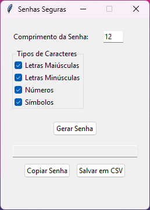

# Gerador de Senhas Seguras com Interface Gráfica



Um gerador de senhas aleatórias e seguras desenvolvido em Python com interface gráfica intuitiva, utilizando Tkinter. Gera combinações complexas de caracteres e oferece opções adicionais de gerenciamento de senhas.

## Funcionalidades Principais

- 🔒 Geração de senhas seguras usando a biblioteca `secrets`
- 🖥️ Interface gráfica amigável e responsiva
- ⚙️ Personalização de parâmetros:
  - Comprimento da senha (1-100 caracteres)
  - Tipos de caracteres incluídos:
    - Letras maiúsculas (A-Z)
    - Letras minúsculas (a-z)
    - Números (0-9)
    - Símbolos especiais (!@#$% etc.)
- 📋 Copiar senha para área de transferência com um clique
- 💾 Salvar histórico de senhas em arquivo CSV com registro de data/hora
- 🚨 Validação de entradas e feedback visual
- 🕒 Mensagens de status temporizadas

## Requisitos

- Python 3.6 ou superior
- Bibliotecas padrão (não requer instalações adicionais):
  - `tkinter`
  - `secrets`
  - `csv`
  - `datetime`

## Instalação e Execução

1. Clone o repositório ou faça o download do arquivo `.py`:
```bash
git clone https://github.com/linsj-vanessa/geradorSenhas.git